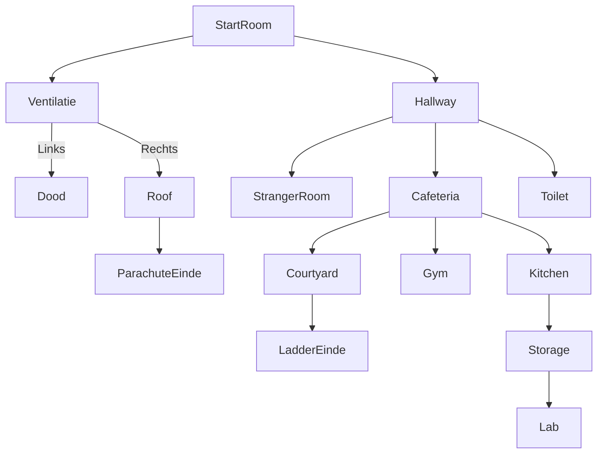

# Game flow
**TODO:** Beschrijf hier hoe alle *game objects* uiteindelijk leiden tot het uitspelen van het spel, of naar meerdere eindes. Doe dit middels een of meerdere [*Puzzle Dependency Chart*](https://grumpygamer.com/puzzle_dependency_charts/). Hiervoor kan de tool [Puzzlon](https://adventuron.io/puzzlon/) gebruikt worden (aangeraden*), maar het kan ook met een [Mermaid flowchart diagram](https://mermaid.js.org/syntax/flowchart.html). Maak daarnaast middels een Mermaid flowchart diagram een duidelijke kaart van hoe de verschillende *rooms* met elkaar verbonden zijn.

## Overzichtskaart 

## Rooms Flowcharts

### Startroom

### Roof

### Toilet

### Stranger Room

### Cafeteria

### Kitchen

### Gym

### Storage

### Courtyard

\* Aangeraden omdat het goed overweg kan met (zeer) grote diagrammen. Plaats zowel de code als de geëxporteerde SVG's op deze pagina.

## **1. Start Room**
### Objects:
- **Fork** → Opens the **ventilation**, leading to **(3. Ventilation)**.
- **Painting** → Breaks the **window**, leading to **(2. Hallway)**.

---

## **2. Hallway**
- Leads to three different rooms:
  - **(5. Stranger Room)**
  - **(6. Cafeteria)**
  - **(7. Toilet)**

---

## **3. Ventilation**
- **Left** → Leads to **death** (Game Over).
- **Right** → Leads to **(4. Roof)**.

---

## **4. Roof**
### Escape Methods:
1. **Parachute Escape**
   - **Requires:**
     - **Sheets** (from **5. Stranger Room**)
     - **Rope** (from **10. Courtyard**)
   - **Use parachute** to escape → **Game Completed**.

### **Item:**
- **hammer** (used for crafting a ladder).
- **4 sticks** (used for crafting a ladder).

---

## **5. Stranger Room**
### Items:
- **Key** (inside a drawer) → Used to open a **cabinet**.
- **Cabinet contains:**
  - **Clothes** (needed to enter certain areas).
  - **Sheets** (needed for parachute crafting).

---

## **6. Cafeteria**
### **NPC: Cleaner**
- **Needs:** A **bucket filled with water** (found in **7. Toilet**).
- **Reward:**
  - Moves aside, allowing access to **(9. Kitchen)**.
  - Gives a **10-euro bill** (used for trade in **7. Toilet**).

### **Item:**
- **Focus Drink** (used for crafting in **Room 12: Lab**).

---

## **7. Toilet**
### **NPC: Dealer**
- **Trade Options:**
  - **Give him Powdered Sugar** (from **9. Kitchen**) → **Get Steroids**.
  - **Give him 10-euro bill** (from **6. Cafeteria**) → **Get Cigarettes**.

### **Items:**
- **Air Freshener** (used for crafting a bomb).

### **Bomb Escape:**
- **Crafting:**
  - **Air Freshener + Lighter** (from **10. Courtyard**) = **Bomb**.
  - **Use Bomb to destroy the wall and escape.**

---

## **8. Storage**
### **Items:**
- **Lab Clothes** → Inside a **locked cabinet** (requires **Kitchen Knife** from **9. Kitchen** to open).
- **Wire Cutter** → Inside a **sealed box** (requires **Kitchen Knife** to open).

---

## **9. Kitchen**
### **NPC: Chef**
- **How to get the Storage Key:**
  - **Option 1:** Give him a **Fork** (from **Start Room**).
  - **Option 2:** **Threaten him with the Kitchen Knife**.
- **Outcome:** Either way, you get the **Storage Key** to access **8. Storage**.

### **Items:**
- **Kitchen Knife** (used for multiple tasks in **Storage**).
- **Baking Soda** (found on the **kitchen table**, needed for **Acid crafting in Lab**).

---

## **10. Courtyard**
### **Items:**
- **6 Sticks** (used for ladder crafting).
- **Ropes** (used for parachute crafting).

### **NPC: Smoker**
- **Trade:** Give him **Cigarettes** (from **7. Toilet**) → **Get Lighter**.

### **Ladder Escape:**
- **Requirements:**
  - **10 Sticks (4 from 4. Roof + 6 from Courtyard)**.
  - **Superglue (from 8. Storage)**.
  - **Hammer (from 4. Roof)**.
- **Build ladder and escape** → **Game Completed**.

---

## **11. Gym**
### **NPC: Gym Freak**
- **Trade:** Give him **Steroids** (from **7. Toilet**).
- **Result:** He smashes a **wall**, allowing **escape**.

---

## **12. Lab**
### **NPC: Lab Professor**
- **Teaches you how to craft Acid** if you bring him the required ingredients.

### **Items:**
- **Sulfuric Powder** → Found inside the **Lab**.
- **Glass Beaker** → Used to mix chemicals.

### **Crafting Acid:**
- **Ingredients:**
  - **Focus Drink (from 6. Cafeteria)**.
  - **Baking Soda (from 9. Kitchen)**.
  - **Sulfuric Powder (found in 12. Lab)**.
  - **Use the Glass Beaker to mix.**
- **Result:** Creates **Corrosive Acid**.

### **Escape Method:**
1. **Wear Lab Clothes** (from **8. Storage**) to enter.
2. **Disable Security Camera with Wire Cutter** (from **8. Storage**).
   - If you **don’t disable the camera**, you **die**.
3. **Craft Acid and pour it on the metal door to escape.**
4. **Escape through the Lab Exit.**

---

### **Multiple Escape Routes:**
1. **Parachute Escape** (Roof)
2. **Ladder Escape** (Courtyard)
3. **Bomb Escape** (Toilet)
4. **Wall Smash Escape** (Gym)
5. **Acid Escape** (Lab)
