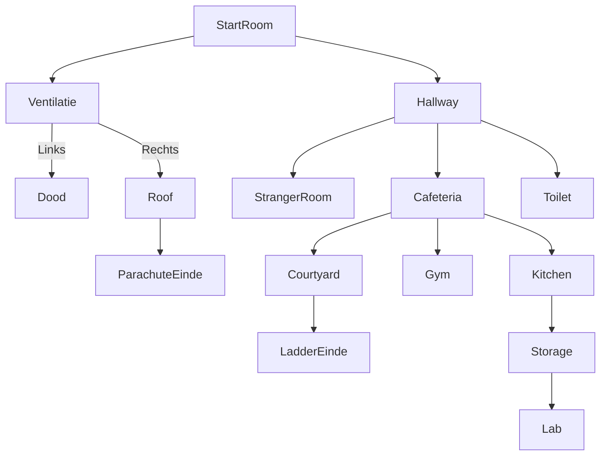

# Game flow
**TODO:** Beschrijf hier hoe alle *game objects* uiteindelijk leiden tot het uitspelen van het spel, of naar meerdere eindes. Doe dit middels een of meerdere [*Puzzle Dependency Chart*](https://grumpygamer.com/puzzle_dependency_charts/). Hiervoor kan de tool [Puzzlon](https://adventuron.io/puzzlon/) gebruikt worden (aangeraden*), maar het kan ook met een [Mermaid flowchart diagram](https://mermaid.js.org/syntax/flowchart.html). Maak daarnaast middels een Mermaid flowchart diagram een duidelijke kaart van hoe de verschillende *rooms* met elkaar verbonden zijn.

## Kitchen

## Storage

## Roof

## Gym

\* Aangeraden omdat het goed overweg kan met (zeer) grote diagrammen. Plaats zowel de code als de geëxporteerde SVG's op deze pagina.

1. In de start kamer heb je 2 objecten die je kan vinden: Vork en paiting.
Painting > maak je de raam kapot en kom je bij de (2 Hallway).
Vork > Hiermee maak je ventalie open en kruip je er doorheen (3 Ventalatie)

2. Hallway > Hier kan je naar 3 verschillende kamers gaan: (5 Stranger room) (6 Cafeteria) (7 Toilet)

3. Ventaltie > Hier heb je de keuze om naar links of rechts te gaan
Links > je bent dood ( einde spel).
Rechts hier kom je bij de ( 4 Roof).

4. Roof > hier tref je een parachute aan die je moet maken van de sheets en rope. > Hiermee ontsnap je ( einde spel).
        > hier tref je ook 10 takken die je later kan gebruiken om te snappen via (10  Courtyard)

5. Stranger room > hier tref je een patient aan. De patient heeft een sleutel waarmee je de kast kan openen waar extra pair of clothes and sheets in zitten. > hiermee kan je dus de parachute maken om te escape bij de ( 4. Roof)

6. Cafeteria > hier kom je als je de trap op gaat > hier tref je een NPC aan de cleaner > ....

7. Toilet > In de toilet vind je een NPC de dealer > ook zit hier een storage card waarmee je de ( 8 storage) in kan gaan. De dealer heeft ook steiroads als je hem de poedersuiker geeft ( gevonden worden in de 9 KITCHEN).

8. Storage > hier vind je superglue om de ladder te kunne maken om te ontstnsppen bij de ( 10 courtyard ) 

9. Kitchen > Hier tref je de NPC aan de chef > ook kan je een kitchen knife vinden en deze kan gebruik worden als een wapen. > ook kan je poedersuiker vinden om deze om te ruilen voor steirods bij ( 7 Toilet).

10. Courtyard > hier vind je de ropes waarmee parachute kan maken om te ontsappen bij de ( 4 roof).
              > Als je de 10 takken van de ( 4 Roof) en de superglue van ( 8 Storage) kan je een ladder maken en hier ontstappen (einde spel )
11. Gym > Hier kan je een NPC vinden de GymFreak > hem kan je steiroids geven en hij zal een muur voor je kapot slaan om naar de storage te gaan.

12. Lab > Hier tref je de dokter aan > ...
