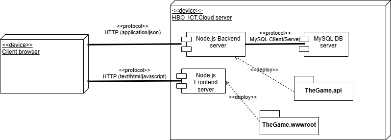
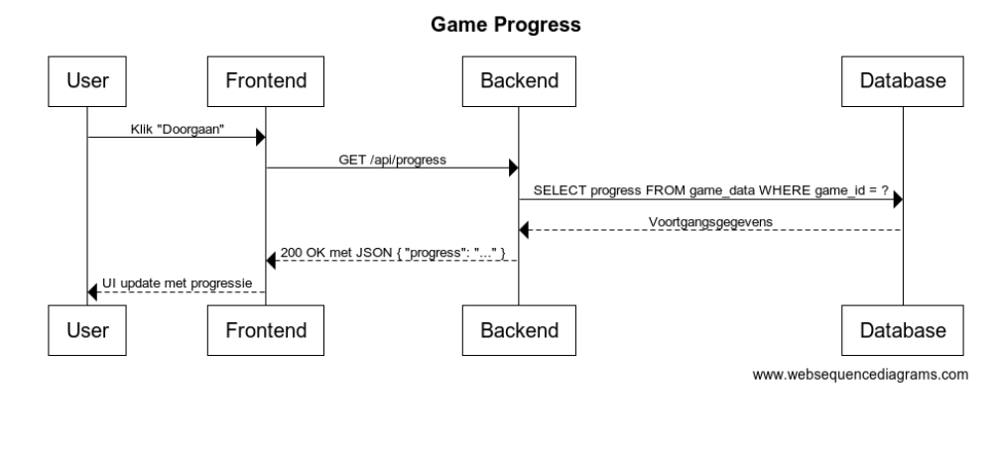

# Inleiding

De inleiding geeft een beknopt overzicht van de aanleiding, centrale vraag, en opzet van het document. Beantwoordt de volgende vragen in ca. 1 alinea per vraag:

-   Je schrijft het verslag voor Lucastars. Geeft kort uitleg over de organisatie en de betrokken stakeholders. Gebruik hiervoor de HBO-ICT Knowledgebase.

-   De aanleiding en doel van het verslag is duidelijk krijgen wat de technische netwerkeisen zijn voor de game. Ligt kort toe hoe je deze onderzocht hebt, noem hierbij ook je de hoofdvraag. **Tip:** Je kunt het onderzoeken met behulp van de bestaande (technische) product documentatie, documentatie van Express.js en gesprekken met de product owner.

-   Leg kort uit aan de hand van welke onderwerpen je de bovenstaande hoofdvraag beantwoord.

# Context en Vereisten

Om een IT-infrastructuur te ontwerpen, moet je twee belangrijke onderdelen beschrijven: de organisatorische context en de vereisten. Volg onderstaande stappen om dit helder en bondig op te stellen:

## Organisatorische Context

**Stap 1: Beschrijf de organisatorische context**

Voorbeelden van processen in een text-based adventure game:

**Voorbeelden van contextonderdelen in dit project:**

1.  Opdracht en opdrachtgever

    -   De game wordt ontwikkeld als Proof of Concept voor Game Studio Luca Stars.

    -   Stakeholders zoals de Product Owner (P.O.) en CTO bepalen de inhoudelijke en technische eisen.

2.  Gebruikers en hun rollen

    -   Spelers: Gebruiken de game, slaan voortgang op en hervatten het spel.

    -   Ontwikkelteam: Werkt aan gamefunctionaliteit, backend en database.

    -   Docenten & begeleiders: Begeleiden het ontwikkelproces en beoordelen het eindproduct.

Vragen om de context te beschrijven:

-   Wie zijn de gebruikers van de infrastructuur?

-   Welke acties voeren zij uit? Hoe vaak?

-   Welke bedrijfsdoelen ondersteunt de infrastructuur?

-   Welke interacties vinden plaats tussen gebruikers en de infrastructuur?

-   Hoe worden gegevens verwerkt, opgeslagen en beveiligd binnen de infrastructuur?

-   Welke eisen of verwachtingen stellen stakeholders aan de infrastructuur?

## Technische Context

**Stap 2: Beschrijf de belangrijkste infrastructuur-concepten**

Gebruik de HBO-ICT Knowledgebase om de infrastructuur-concepten beter te begrijpen en concreet te maken. Hier zijn enkele voorbeelden:

-   Centrale data-opslag: Een database waarin voortgang, keuzes en spelgegevens worden opgeslagen, zoals MySQL.

-   API's voor communicatie: Back-end endpoints gebouwd met Express om frontend en database te verbinden.

-   Authenticatie en beveiliging: Mechanismen zoals inloggen, HTTPS, en encryptie om gegevens veilig te houden.

-   Frontend-componenten: Herbruikbare en modulaire elementen met Web Components om de gebruikersinterface te ondersteunen.

-   Data-uitwisseling: Gebruik van de Fetch API voor real-time communicatie tussen de frontend en backend.

> De volgende Deployment Diagram geeft inzicht in de verschillende onderdelen van "The Game":

Deze concepten ondersteunen functionele vereisten zoals het opslaan van voortgang, veilige communicatie, en ondersteuning voor meerdere gebruikers. Raadpleeg de HBO-ICT Knowledgebase voor uitgebreide uitleg en praktische voorbeelden.

## Vereisten, standaarden, en richtlijnen

**Stap 3: Beschrijf vereisten, standaarden, en richtlijnen**

Bij het ontwerpen van de infrastructuur moet je de vereisten, standaarden, en richtlijnen van de opdrachtgever helder beschrijven. Je moet ze niet alleen noemen, maar ook uitleggen wat hier voor nodig is. Overleg met de product owner over wat hij hier van jullie verwacht. Hier zijn enkele voorbeelden:

### Functionele vereisten

-   Minstens 100 gelijktijdige spelers kunnen de game spelen.

-   Gebruikers kunnen als de P.O. dit wil voortgang opslaan en hervatten op verschillende apparaten.

-   De game is toegankelijk via een webbrowser met een centrale database, of wellicht ook via een app.

### Technische vereisten

-   De API ondersteunt veilige communicatie via HTTPS.

-   Data wordt centraal opgeslagen in een database.

-   Er is een schaalbare infrastructuur om groeiende spelersaantallen aan te kunnen.

### Standaarden en richtlijnen

-   Volg industriepraktijken zoals OWASP-beveiligingsrichtlijnen voor veilige API's.

-   Gebruik coding standards voor TypeScript en Node.js, zoals de ESLint-configuratie in de HBO-ICT Knowledgebase.

### Wetten en regelgeving

-   Voldoe aan privacywetten zoals de AVG (GDPR) bij het opslaan van gebruikersdata.

Tip: Controleer of alle vereisten testbaar zijn. Testbaarheid helpt je later in het project om succes te meten en eventuele aanpassingen te maken. Raadpleeg de HBO-ICT Knowledgebase voor meer details over standaarden en richtlijnen.

# Infrastructuur

Dit hoofdstuk richt zich op het beschrijven van de infrastructuur zoals deze draait op de HBO-ICT.Cloud. Tijdens de ontwikkeling werkt het team lokaal (op je eigen pc) aan de game, maar voor testen en productie wordt gebruikgemaakt van een ontwikkel- en liveomgeving op de HBO-ICT.Cloud. Aangezien de infrastructuur vooraf is vastgelegd, ligt de nadruk op het documenteren van bestaande configuraties, het verduidelijken van de communicatie tussen onderdelen en het onderzoeken van verbeterpunten.

## Inrichting van de infrastructuur

**Stap 4: Beschrijf de inrichting van de infrastructuur**

De infrastructuur voor dit project wordt volledig gehost op de HBO-ICT.Cloud, bestaande uit:

1.  Frontend: Een statisch gehoste webapplicatie.

2.  Backend: Een API-server, draaiend op Express.js.

3.  Database: Een MySQL-server, die door het team wordt ingericht.

Teamgegevens

Vul hieronder de specifieke gegevens in die voor jouw team van toepassing zijn:

-   Frontend URL: \<URL van team\>

-   Backend URL: \<URL van API-server\>

-   MySQL-server: \<Serveradres\>

-   Poorten: Controleer en documenteer welke poorten door je team worden gebruikt voor database- en API-communicatie.

## Communicatie en sequence diagram

**Stap 5: Beschrijf de communicatie tussen de systemen**

## Beveiliging van de infrastructuur

**Stap 6: Omschrijf hoe de systemen veilig ingericht kunnen worden**

HTTPS (standaard in HBO-ICT.Cloud):	Verzekert versleutelde communicatie
Inputvalidatie & parameterized queries:	Voorkomt SQL-injectie en XSS-aanvallen
Rate Limiting (express-rate-limit):	Beschermt tegen DDoS-aanvallen
CORS-configuratie:	Voorkomt ongewenste toegang vanaf andere domeinen
Environment variables (.env):	Voorkomt blootstelling van gevoelige gegevens
JWT Authenticatie:	Beveiligde toegang tot API-endpoints
Database rechten beperken:	Voorkomt onnodige toegang tot databasegegevens
Versleuteling (bcrypt):	Wachtwoorden veilig opslaan

# Realiseren

In dit hoofdstuk beschrijf je hoe het project live wordt gezet op de HBO-ICT.Cloud, welke beveiligingsmaatregelen je implementeert, en hoe je omgaat met de inrichting van de database.

## Deployen op de HBO-ICT.Cloud

**Stap 7: Omschrijf hoe je het project uitrolt op de HBO-ICT.Cloud en welke methode je gebruikt:**

In het project wordt gebruik gemaakt van handmatige deployment. Hierbij wordt er gebruik gemaakt van FTP (File Transfer Protocol). Dit is eenvoudiger dan een CI/CD systeem omdat er geen geautomatiseerde pipelines hoeven te worden opgezet.

De uitrol gebeurt als volgt:

*   Frontend:
    1. Gebruik `npm run build` in de frontend-map.
    2. Maak verbinding met de HBO-ICT.Cloud via een FTP programma. 
    3. Upload de bestanden naar de aangewezen map op de cloud.
*   Backend:
    1. Zorg ervoor dat alle dependencies in het project zijn geïnstalleerd: `npm install`
    2. Upload de backend-code naar de cloud via de FTP netwerk protocol.
    3. In het .env bestand moeten de juiste environment variables (database-wachtwoorden, API-keys, etc..) staan om te connecten met de database

Nadat de frontend en de backend zijn geupload naar de cloud, worden er tests uitgevoerd op basis van de volgende checks:
    1. De frontend wordt correct geladen in de browser.
    2. De backend reageert correct op API-requests.
    3. Er is een correcte verbinding met de database (Geen foutmeldingen, CRUD-operaties werken, correcte configuratie van env-variabelen).

## Beveiligingsmaatregelen

**Stap 8: Omschrijf welke maatregelen je implementeert**

Op de HBO-ICT.Cloud is HTTPS standaard actief, maar we nemen extra maatregelen om de backend en database te beveiligen. Het is de bedoeling om de volgende maatregelen te implementeren:
    1. CORS (Cross-Origin Resource Sharing). Door gebruik te maken van CORS beperken we de toegang tot de API zodat alleen specifieke domeinen er gebruik van kunnnen maken. Configureer met behulp van ExpressJS om alleen verzoeken toe te staan van een lijst met betrouwbare domeinen.
    2. Environment Variabelen: Door gebruik te maken van environment variabelen kunnen gevoelige gegevens zoals databasewachtwoorden of API-keys veilig worden opgeslagen. Het is belangrijk om de .env-bestand **niet** up te loaden naar de remote repository. Er wordt ook ervoor gezorgd dat de cloud dit bestand correct inlaadt en dat deze variabelen ook daadwerkelijk voorkomen in de code.
    3. Monitoring: Het is belangrijk om de status van de applicatie bij te houden om enige verdachte activiteiten zo snel mogelijk te detecteren. Het bijhouden hiervan zal versimpeld worden door belangrijke gebeurtenissen te loggen (nieuwe sessies, game starts ...) en gebruik te maken van try-catch blocks om mogelijke corruptie te identificeren. 

## Database-inrichting

**Stap 9: Omschrijf welke gegevens je opslaat in de database en waarom, met aandacht voor "privacy by design":**

-   Data per tabel:

    -   Gegevens: Welke gegevens sla je op? Voeg een ERD toe.

    -   Waarom: Waarom heb je deze gegevens nodig?

-   Privacy by design:

    -   Minimaliseer opgeslagen data: sla alleen op wat nodig is voor de functionaliteit.

    -   Gebruik versleuteling (bijv. hashing voor wachtwoorden).

    -   Zorg dat gevoelige gegevens niet toegankelijk zijn zonder authenticatie.

## Implementatieplan

**Stap 10: Stel een implementatieplan op met duidelijke stappen**

1.  Backend configureren

2.  Frontend uploaden

3.  Database-inrichting

4.  Beveiliging implementeren

5.  Controle en afronding

Dit hoofdstuk richt zich op een efficiënte en veilige uitrol van de applicatie. Door de stappen systematisch te volgen, zorg je voor een goed functionerende infrastructuur. **Tip:** Raadpleeg de HBO-ICT Knowledgebase voor voorbeelden van configuratie en deployment-methoden.
