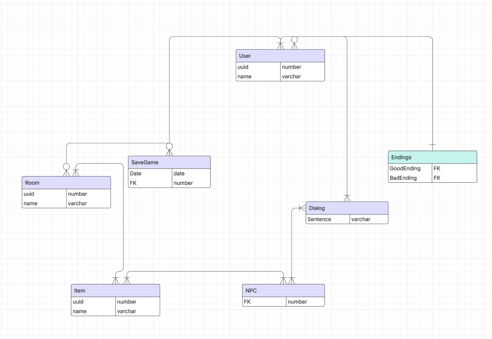

## Design Database 

#### ERD

-  Waarom heb je deze gegevens nodig?
    -  De gegevens zijn nodig om de database te kunnen ontwerpen en te kunnen implementeren.

- Privacy by design:

    Hoe past jouw ERD bij Privacy by Design?

    - User-tabel:

        - De tabel bevat minimale gegevens (uuid en name). Voeg een veld toe voor wachtwoorden (password) als je gebruikers laat inloggen. Sla dit gehasht op.

    - SaveGame-tabel:
        - De tabel bevat alleen een datum en FK, wat voldoende is voor het opslaan van voortgang zonder onnodige informatie.

    - Item-, Room-, NPC-, Dialog-, en Endings-tabellen:
        
       - Deze tabellen bevatten alleen functionele gegevens die nodig zijn voor gameplay. Er is geen persoonlijke informatie aanwezig, wat goed aansluit bij privacyprincipes.

## Implementatieplan

- Backend configureren

    - Server opzetten: Gebruik Node.js en Express om een server op te zetten. Installeer benodigde pakketen zoals 'express', 'cors', 'dotenv'.

    - Database opzetten: Gebruik MySQL en phpAdmin om een database op te zetten. Maak tabellen aan voor User, SaveGame, Item, Room, NPC, Dialog, en Endings.

    - API opzetten: Maak API endpoints voor het ophalen en opslaan van gegevens in de database.

- Frontend configureren

    - Er wordt gebruik gemaakt van plane TypeScript, HTML en CSS (MVC) structuur.

- Beveiliging implementeren

    - Gebruik van uuid voor het identificeren van gebruikers.

    - Gebruik CORS om cross-origin requests te beheren.

- Controle en afronding

    - Testen: Test de API endpoints en de databaseverbinding.

    - Documentatie: Documenteer de API endpoints en de databasestructuur.

    - Merge request aanmaken: Zodat even van de teamgenoten de code kan controleren en feedback d'r op kan geven
