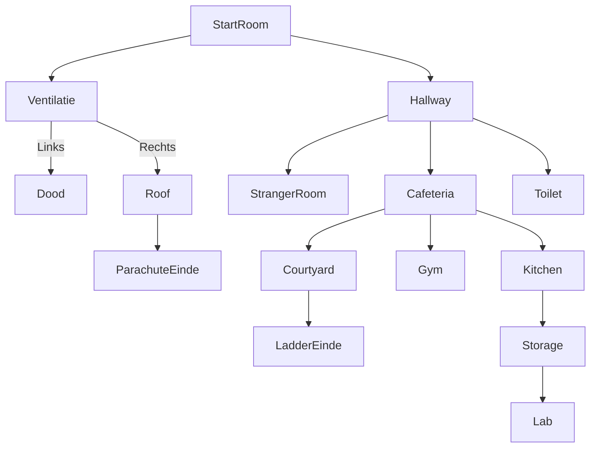

## TMC 1

### Think

De eerste versie was in feite ons game design document. Hierin hebben we alles rondom de game gebrainstormd: de gameflow uitgedacht, UI-prototypes gemaakt, moodboards samengesteld ter inspiratie, en meer.

### Make

Bij de make zijn we begonnen met het maken van de game. Hierbij hebben we bijna alle rooms kunnen maken:

[StarterRoom](/docs/tmc/images/cyclus-1/starterroom.png)
[Vents](/docs/tmc/images/cyclus-1/vents.png)
[RoofRoom](/docs/tmc/images/cyclus-1/roofroom.png)
[Hallway](/docs/tmc/images/cyclus-1/hallway.png)
[ToiletRoom](/docs/tmc/images/cyclus-1/toiletroom.png)
[StrangerRoom](/docs/tmc/images/cyclus-1/strangerroom.png)
[CafeteriaRoom](/docs/tmc/images/cyclus-1/cafeteriaroom.png)
[CourtyardRoom](/docs/tmc/images/cyclus-1/courtyardroom.png)
[GymRoom](/docs/tmc/images/cyclus-1/gymroom.png)
[KitchenRoom](/docs/tmc/images/cyclus-1/kitchenroom.png)
[StorageRoom](/docs/tmc/images/cyclus-1/storageroom.png)

De meeste rooms bevatten al veel functionaliteiten, maar het spel is nog niet helemaal voltooid. Er is echter wel een werkende versie die getest kan worden.

### Check
#### Test plan

