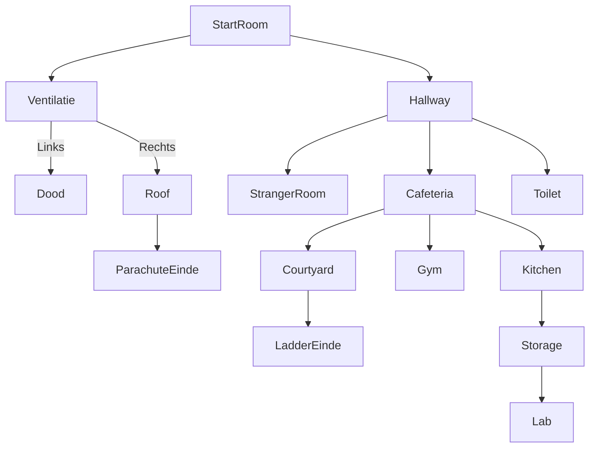

## TMC 1

### Think

De eerste versie was in feite ons game design document. Hierin hebben we alles rondom de game gebrainstormd: de gameflow uitgedacht, UI-prototypes gemaakt, moodboards samengesteld ter inspiratie, en meer.

### Make

Bij de make zijn we begonnen met het maken van de game. Hierbij hebben we bijna alle rooms kunnen maken:

[StarterRoom](/docs/tmc/images/cyclus-1/starterroom.png)
[Vents](/docs/tmc/images/cyclus-1/vents.png)
[RoofRoom](/docs/tmc/images/cyclus-1/roofroom.png)
[Hallway](/docs/tmc/images/cyclus-1/hallway.png)
[ToiletRoom](/docs/tmc/images/cyclus-1/toiletroom.png)
[StrangerRoom](/docs/tmc/images/cyclus-1/strangerroom.png)
[CafeteriaRoom](/docs/tmc/images/cyclus-1/cafeteriaroom.png)
[CourtyardRoom](/docs/tmc/images/cyclus-1/courtyardroom.png)
[GymRoom](/docs/tmc/images/cyclus-1/gymroom.png)
[KitchenRoom](/docs/tmc/images/cyclus-1/kitchenroom.png)
[StorageRoom](/docs/tmc/images/cyclus-1/storageroom.png)

De meeste rooms bevatten al veel functionaliteiten, maar het spel is nog niet helemaal voltooid. Er is echter wel een werkende versie die getest kan worden.

### Check

## Test plan

Het doel van dit testplan is om te controleren of de speler alle kamers in het spel kan betreden en of de navigatie correct werkt. De test zal ook beoordelen of de gameflow logisch en intuïtief is.

## Testomgeving

- platform: pc/browser

 Navigatie en Toegankelijkheid van Kamers

Doel: De gebruiker moet elke kamer kunnen betreden via de juiste paden.

Testers wordt gevraagd hun bevindingen te noteren:

Waren er kamers die je niet kon betreden?

Werkten alle objecten zoals verwacht?

Waren er bugs of onverwachte gebeurtenissen?

Was de gameflow duidelijk en intuïtief?

Opmerking: Testresultaten worden verzameld en geëvalueerd om de game verder te verbeteren.

## Feedback testers

Aydin

- Het ziet er mooi uit
- Mooi dat de items weggaan als je op pakt
- Misschien een hint knop
- Moeilijk level: Hard.
- Pijltjes laten werken.
8/10

In 8:00 minuten uitgespeeld.

Matisse

- Titel pagina ziet er goed uit wel moeilijk te lezen
- Visual inventory
- Scroll is moeilijk
- Paarse bar te kort
- Filter dingen die niet kunnen interacteren
- Cafeteria --> gym niet logisch het is te random.
- Prima te navigeren
6/10

In 8:59 minuten uitgespeeld.
