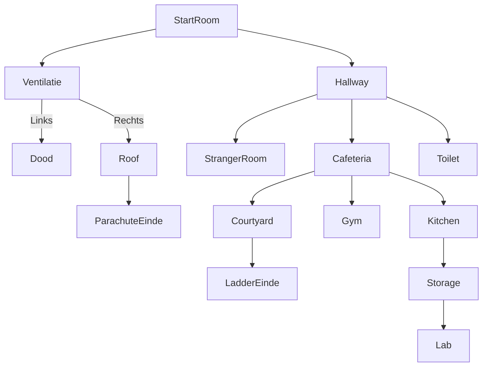

## TMC 1

### Think

De eerste versie was in feite ons game design document. Hierin hebben we alles rondom de game gebrainstormd: de gameflow uitgedacht, UI-prototypes gemaakt, moodboards samengesteld ter inspiratie, en meer.

### Make

Bij de make zijn we begonnen met het maken van de game. Hierbij hebben we bijna alle rooms kunnen maken:

[StarterRoom](/docs/tmc/images/cyclus-1/starterroom.png)
[Vents](/docs/tmc/images/cyclus-1/vents.png)
[RoofRoom](/docs/tmc/images/cyclus-1/roofroom.png)
[Hallway](/docs/tmc/images/cyclus-1/hallway.png)
[ToiletRoom](/docs/tmc/images/cyclus-1/toiletroom.png)
[StrangerRoom](/docs/tmc/images/cyclus-1/strangerroom.png)
[CafeteriaRoom](/docs/tmc/images/cyclus-1/cafeteriaroom.png)
[CourtyardRoom](/docs/tmc/images/cyclus-1/courtyardroom.png)
[GymRoom](/docs/tmc/images/cyclus-1/gymroom.png)
[KitchenRoom](/docs/tmc/images/cyclus-1/kitchenroom.png)
[StorageRoom](/docs/tmc/images/cyclus-1/storageroom.png)

De meeste rooms bevatten al veel functionaliteiten, maar het spel is nog niet helemaal voltooid. Er is echter wel een werkende versie die getest kan worden.

### Check

## Test plan

Het doel van dit testplan is om te controleren of de speler alle kamers in het spel kan betreden en of de navigatie correct werkt. De test zal ook beoordelen of de gameflow logisch en intuïtief is.

## Testomgeving

- platform: pc/browser

## Testscenario’s

 Navigatie en Toegankelijkheid van Kamers

Doel: De gebruiker moet elke kamer kunnen betreden via de juiste paden.

#### Stappen & Acties

Verwacht Resultaat

1

Start de game

De game start zonder fouten

2

Navigeer naar de Hallway

De speler kan naar de Hallway gaan

3

Ga naar de Stranger Room

De speler kan de Stranger Room betreden

4

Ga naar de Toilet Room

De speler kan de Toilet Room betreden

5

Probeer toegang te krijgen tot het Lab zonder de juiste kleding

De toegang wordt geweigerd

6

Verzamel de juiste kleding en probeer opnieuw toegang te krijgen tot het Lab

De speler kan nu het Lab betreden

7

Gebruik de ventilatieschacht en kies links

De speler sterft en moet opnieuw beginnen

8

Gebruik de ventilatieschacht en kies rechts

De speler komt op het dak

9

Gebruik de parachute op het dak

De speler ontsnapt succesvol

3.2 Interactie met Objecten en NPC’s

Doel: Testen of de gebruiker objecten kan oppakken en NPC’s correct reageren.

#### Stap & Actie

Verwacht Resultaat

1

Probeer een object op te pakken in de Stranger Room

Het object wordt correct toegevoegd aan de inventaris

2

Spreek met de NPC in de Toilet Room

De dialoog werkt en de speler krijgt het juiste item

3

Gebruik een sleutel om een deur te openen

De deur gaat alleen open als de speler de juiste sleutel heeft

4. Testcriteria

De speler moet alle kamers kunnen betreden via de juiste routes.

Objecten moeten correct worden opgepakt en weergegeven in de inventaris.

NPC’s moeten correct reageren en juiste items geven.

Het spel moet niet crashen of vastlopen.

De speler moet op logische wijze de game kunnen voltooien.

5. Gebruikte Tools

Handmatige tests door gebruikers

Eventuele logging-tools om errors vast te leggen

6. Feedback en Testresultaten

Testers wordt gevraagd hun bevindingen te noteren:

Waren er kamers die je niet kon betreden?

Werkten alle objecten zoals verwacht?

Waren er bugs of onverwachte gebeurtenissen?

Was de gameflow duidelijk en intuïtief?

Opmerking: Testresultaten worden verzameld en geëvalueerd om de game verder te verbeteren.
